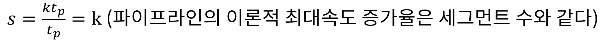

## 병렬 처리

- 컴퓨터 시스템의 계산 속도 향상을 목적으로함. 동시 데이터 처리기능 제공
  - 사용 레지스터의 형태에 따른 병렬성 구현
  - 동일한 또는 서로 다른 동작을 동시에 수행하는 여러 개의 기능장치를 가지고서 데이터를 각각의
    장치에 분산 시켜 작업을 수행하는 경우

- M.J Flynn 분류
  - SISD : 명령라인 1, 데이터 처리 라인 1
    명령어 순차실행, 병렬처리 다중 기능 장치나 파이프라인 처리에 의해서 구현
  - SIMD : 명령라인 1, 데이터 라인 복수
    공통의 제어장치 아래에 여러 개의 처리장치를 두는 구조
    모든 프로세서가 동시에 메모리에 접근 할 수 있도록 다중 모듈을 가진 공유 메모리 장치가 필요
  - MISD : 명령 복수, 데이터 처리 라인 1
  - MIMD : 명령 복수, 데이터 처리 복수
    여러 프로그램을 동시에 수행하는 능력을 가진 컴퓨터 시스템
    대부분의 다중 프로세서와 다중 컴퓨터 시스템이 이 범주에 속함

## 파이프 라인

### 파이프라인 구조의 성능

- 파이프라인의 동작은 공간/시간표에 의해 설명 되는데, 이것은 시간에 대한 함수로서 세그먼트의 사용상황을 보여준다.
- 파이프라인의 이론적 최대속도 증가율은 세그먼트 수와 같다.

### 파이프 라인의 구현

- 하나의 프로세스를 서로 다른 기능을 가진 여러 개의 서브프로세스로 나누어 각 프로세스가 동시에 서로 다른 데이터를 취급하도록 하는 기법
- 각 세그먼트에서 수행된 연산결과는 다음 세그먼트로 연속적으로 넘어가게 되어 데이터가 마지막 세그먼트를 통과하게 되면 최종적인 연산 결과를 얻게 된다 - 하나의 프로세스를 다양한 연산으로  중복시킬 수 있는 근간은 각 세그먼트마다의 레지스터이다.

### 파이프 라인의 일반적 고찰

- 동일한 복잡도의 부연산들로 나뉘어지는 어떠한 연산 동작도 파이프라인 프로세서에 의해 구현 될 수 있다.
- 파이프라인 기술은 매번 다른 데이터 집합을 동일한 테스크에 적용시켜 여러 번 반복하는 응용에 효과적이다.
- 

